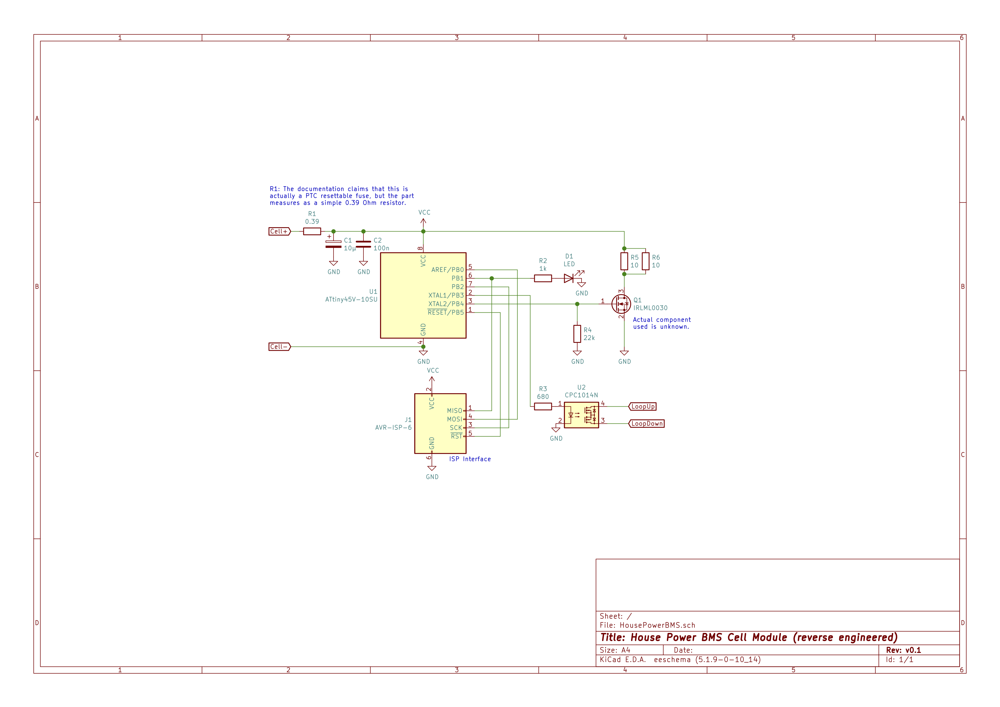
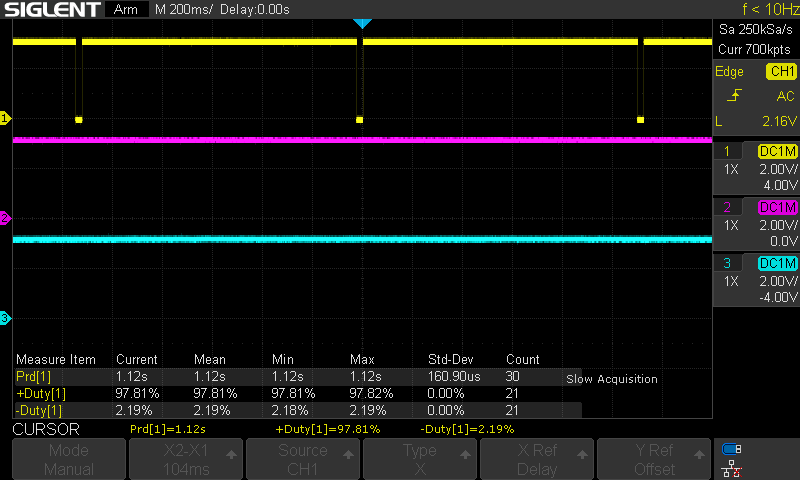
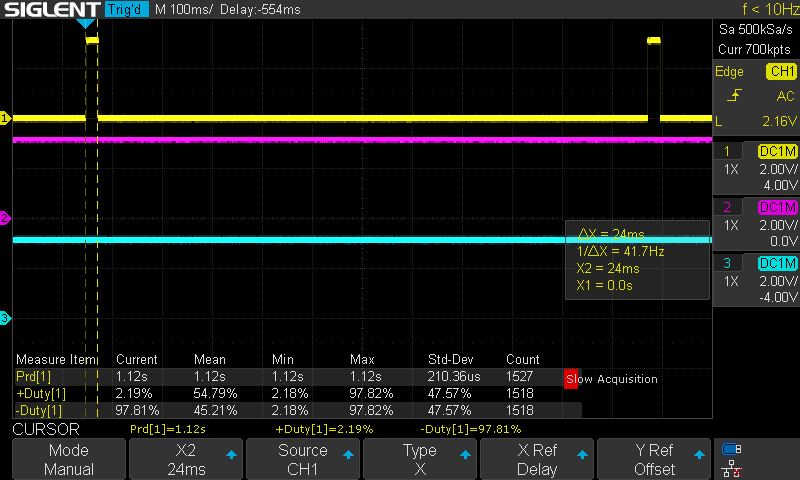
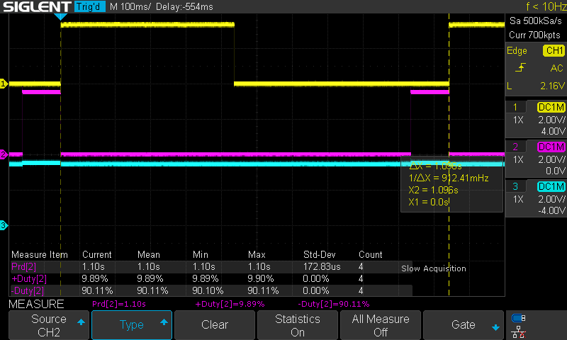
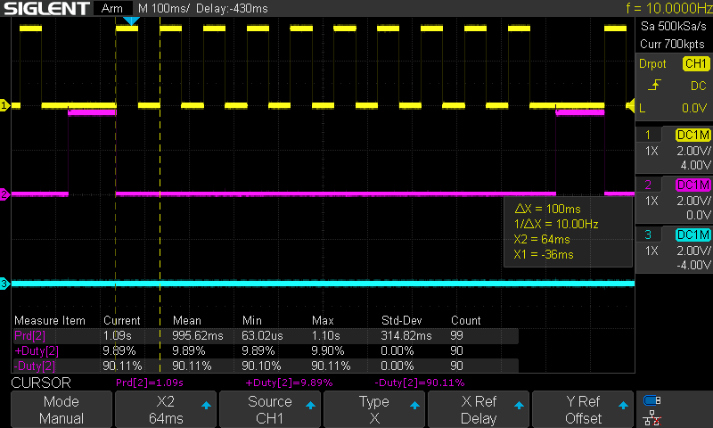

# HousePowerBMS OpenSource Replacement Firmware and Cell Module Reverse Engineering

Copyright 2021 Martin Bartosch

Licensed under the MIT License.

Repository: https://github.com/mbartosch/HousePowerBMSRE

Blog post: https://www.entropypool.de/2021/04/15/housepower-bms-cell-module-reverse-engineering/

## Motivation

The HousePowerBMS is a lightweight Battery Management System for LiFePO4 batteries. It was sold by CleanPowerAuto LLC until about 2017. The manufacturer eventually left the market, spare parts for existing BMS are no longer sold.

The actual cell module hardware is very simple and could easily be repaired, but the critical part is a possible replacement of the microcontroller which not only requires the hardware component but also the firmware. The lock bits of the original cell module firmware have been cleared by the manufacturer, hence a simple 1:1 copy of the firmware is not possible. This was the motivation to perform a proper reverse analysis and reconstruction of the cell module. 

This is an effort to 

- reverse engineer the characteristics of the [House Power BMS Cell Modules](http://cleanpowerauto.com/files/HousePower%20BMS.pdf) and 
- create an independent but compatible OpenSource replacement firmware which emulates the original firmware's behavior in a way that the original House Power BMS main module can still be used.

The [documentation of the BMS is still available for download](http://cleanpowerauto.com/files/HousePower%20BMS.pdf). The remainder of this document assumes that the reader is familiar with this documentation.

*NOTE: Reverse engineering of the House Power BMS head end or main board is not (yet) covered by this project.*

## Overview

## Part 1: OpenSource cell module replacement firmware

**NOTE on chip types (ATTiny45V vs ATTiny85V):** After initial successful testing with an ATTiny85 it became apparent that using software serial on the ATTiny45 is not possible for some reason. The firmware locks up when printing on the serial console. This means that DEBUG mode is not available on the ATTiny45. To calibrate the module use the "bit blinking" calibration mode instead.

### Compilation and deployment

The source code can be built with [PlatformIO](https://platformio.org/).

For the production deployment consider commenting out  `DEBUG` mode. Debug mode prints internal statistics and voltage measurements on a serial console attached to PB2. (Leaving Debug mode enabled is OK, the firmware will be larger but still fit into an ATTiny45V with a few bytes of wiggle room).

Install the firmware via an ISP, e. g. an ASPUSB.

### Fuse settings

Set the processor fuses to `LFuse: 0x62`, `HFuse: 0xde`, `EFuse: 0xff`:

- brownout detection enabled at $V_{CC}$ = 1.8 V
- internal clock 8 MHz, startup time PWRDOWN/RESET: 6 CK/14 CK + 64 ms
- divide clock by 8

### Calibration

It is recommended to calibrate the software to accomodate for ATTiny tolerances before flashing the final firmware of a module.

#### Using "bit blinking"

In this calibration mode the device blinks a bit pattern indicating the measured voltage of the ADC in mV as a binary pattern without applying any calibration factor.

Use this mode for ATTiny45 chips where a serial console is not available.

This must be done *for each individual module*:

- compile and deploy this source with `CALIBRATION_MODE` enabled and `DEBUG` disabled
- attach stable voltage source to cell board Vcc, voltage should be about 3.1 - 3.4 V
- attach a precise volt meter as close as possible to Vcc/GND of cell board
- **wait at least 8 seconds before taking measurements (allow averaging filter to settle)**
- take voltage reading on volt meter, note as "voltage metered"
- observe the LED blinking pattern (see below), convert observed binary value to decimal, note as "voltage software"
- insert these two values (measured in mV) in the below constants `calibration_voltage_metered` and `calibration_voltage_software`
- disable (comment out) `CALIBRATION_MODE` (and `DEBUG)`
- compile and deploy the calibrated source to this particular cell module

##### The blinking pattern

In a repeating cycle the CPU sends 16 bits of data in four groups of four bits, MSB first.

- the sequence starts with a rapid flashing pattern.
- a logical "0" is signaled by a single short flash
- a logical "1" is signaled by a double short flash

Write down all bits of the sequence and convert to decimal.

Example:

0000 1101 0110 1010 converts to 3434.

#### Using the serial console

**NOTE:** This mode is only available when using an ATTiny85. Use "bit blinking" instead for the ATTiny45.

This must be done *for each individual module*:

- attach RXD of a terminal program on the host computer (9600 Baud 8N1) to PB2 (pin 7) of the ATTiny
- compile and deploy this source with `CALIBRATION_MODE` and `DEBUG` enabled
- attach stable voltage source to cell board Vcc, voltage should be about 3.1 - 3.4 V
- attach a precise volt meter as close as possible to Vcc/GND of cell board
- **wait at least 8 seconds before taking measurements (allow averaging filter to settle)**
- take voltage reading on volt meter, note as "voltage metered"
- check value of "Vcc (uncalibrated)" output on the terminal console, note as "voltage software"
- insert these two values (measured in mV) in the below constants `calibration_voltage_metered` and `calibration_voltage_software`
- disable (comment out) `CALIBRATION_MODE` and `DEBUG`
- compile and deploy the calibrated source to this particular cell module

#### Configuration

Cell module operation parameters can be modified according to personal preferences if desired:

```c++
//////////////////////////////////////////////////////////////////////////
// USER CONFIGURATION
// CHANGE THESE VALUES ACCORDING TO THE CALIBRATION RESULTS

// Voltage (mV) measured using a good volt meter
const unsigned long calibration_voltage_metered = 3200;

// Voltage (mV) reported in CALIBRATION_MODE (Vcc_def output)
const unsigned long calibration_voltage_software = 3200;

// ONLY CHANGE THE BELOW VALUES IF YOU KNOW WHAT YOU ARE DOING
// cell module voltage thresholds (in mV)
const long c_LVoltage_engage    = 2900L;
const long c_LVoltage_disengage = 2950L;
const long c_HVoltage_engage    = 3600L;
const long c_HVoltage_disengage = 3550L;

// shunting thresholds
const long c_ShuntVoltage_engage    = 3500L;
const long c_ShuntVoltage_disengage = 3450L;

// number of voltage measurements to average
const byte c_MovingAverageWindow = 5;

// number of consecutive measurements (~1 s cycle time) a new state needs 
// to be stable before beeing committed
const unsigned int c_StateSettleTime = 3;

// special handling/notification if LVC or HVC happened within this 
// time interval (~30 minutes)
const unsigned int c_RecentCutOffDuration = 30 * 60;

```

| Constant                       | Default | Usage                                                        |
| ------------------------------ | ------- | ------------------------------------------------------------ |
| `calibration_voltage_metered`  | 3200    | Voltage in mV measured in calibration mode between Vcc and GND |
| `calibration_voltage_software` | 3200    | Uncalibrated voltage in mV reported by the module in calibration mode |
| `c_LVoltage_engage`            | 2900L   | LVC enable voltage in mV                                     |
| `c_LVoltage_disengage`         | 2950L   | LVC disable voltage in mV (must be higher than `c_LVoltage_engage`) |
| `c_HVoltage_engage`            | 3600L   | HVC enable voltage in mV                                     |
| `c_HVoltage_disengage`         | 3550L   | HVC disable voltage in mV (must be lower than `c_HVoltage_engage`) |
| `c_ShuntVoltage_engage`        | 3500L   | Shunting enable voltage in mV                                |
| `c_ShuntVoltage_disengage`     | 3450L   | Shunting disable voltage in mV (must be lower than `c_ShuntVoltage_engage`) |
| `c_MovingAverageWindow`        | 5       | Moving average window for voltage measurements (number of measurements) |
| `c_StateSettleTime`            | 3       | Number of ~1 s cycles a new cell state or shunting condition must be measured before the new state is assumed |
| `c_RecentCutOffDuration`       | 30 * 60 | If power up or LVC/HVC event happened within the specified number of ~1 s cycles the cell module shows a slow flash pattern if the cell voltage is in normal range. |

### Operation

Similar to the original device, see the original documentation.

**NOTE:** When this firmware starts up it sends a LED blinking pattern of about 15 short flashes. This allows to distinguish a module with the OpenSource firmware from the original modules which immediately go into the "slow flash" mode.

## Part 2: Reverse engineering of the original cell module hardware and firmware

### Cell module hardware

The cell module hardware consists of 

- a [Microchip ATtiny45V](https://www.microchip.com/wwwproducts/en/ATtiny45) microcontroller
- an LED for status information
- a MOSFET driving the shunt resistors
- a solid state relay which operates the cell module loop used to signal HVC/LVC information to the BMS main board

#### Reconstructed schematics



The original documentation claims that a resettable PTC Fuse is used to protect the circuit. Reverse engineering shows that this does not seem to be true, R1 seems to be a simple 0.39 $\Omega$ resistor. 

The resistor seems to be selected to act as current measuring shunt (not to be mistaken with the balancing shunts): in balancing shunting mode a current of about 0.73 A through R5/R6 will cause a voltage drop of about 0,028V over R1. It seems very plausible that the actual voltage measurement is always performed in the "off" cycle of the shunting cycle. However, if an additional measurement is taken in the "on" cycle of the shunting operation the firmware could compute the approximate current through the shunt resistors. It is not clear, however, how this information might be useful.

#### Voltage measurement

The cell voltage is measured using the common AVR trick to measure the internal 1.1 V bandgap reference voltage source using $V_{CC}$ as the reference voltage.

#### Passive balancing shunt

The balancing shunt consists of two parallel 10 $\Omega$  resistors (effectively 5 $\Omega$).

The actual MOSFET driver for the balancing shunt is unknown, any "digital compatible" type with the following specification should work:

- maximum drain-source on-resistance $R_{DS(on max)} \lesssim 0.04 \, \Omega$
- gate threshold voltage $V_{GS(th)} \lesssim 2 \, V$
- drain source voltage $V_{DS} \gtrsim 10 \, V$
- continuous drain current $I_D \gtrsim 2 \, A$
- maximum power dissipation $P_D \gtrsim 0.2 \, W$ (calculate according to maximum $R_{DS(on)}$)

The MOSFET referenced in the above schematic is only one of the many possible options.

#### Cell loop

Each cell module contains a galvanically isolated solid state relay which is able to drive a maxium current of 0.4 A.

### Original cell module characterization and reverse engineering

#### Processor setup

The original ATTiny firmware is protected against extraction via the ISP port by clearing the lock bits in the processor.

Processor fuses have been programmed to `LFuse: 0x62`, `HFuse: 0xde`, `EFuse: 0xff`:

- brownout detection enabled at $V_{CC}$ = 1.8 V
- internal clock 8 MHz, startup time PWRDOWN/RESET: 6 CK/14 CK + 64 ms
- divide clock by 8

#### Processing cycle

After startup the cell module immediately enters the main processing cycle. 

The main processing cycle has a period of approximately 1120 ms.

#### Cell loop communication logic

The House Power BMS main module collects information from the cell modules monitoring the battery bank via a closed cell loop: all cell modules' loop contacts are connected in series to the main module's loop contacts, forming a closed circuit with the main BMS module.

If the individual cell module measures a nominal voltage at the attached cell the cell loop solid state relay is closed. 

If all cell modules close their solid state relay, the main module can detect this situation with a probing current flowing through the loop. 

As long as the probing current can flow through the loop without interruption the main module can be sure that all cells are within nominal parameters.

As soon as one module interrupts the loop by switching off its solid state loop circuit relay the main module will detect that the probing current can no longer flow and act accordingly.

In addition to simply interrupting the loop it is possible to convey a limited amount of information by pulsing the solid state relay, leading to frequently interrupted probe current measured by the main module. This is used to indicate a warning state which does not yet warrant a complete shutoff.

#### Balancing shunt handling

The cell module can switch on the balancing shunt MOSFET in order to dissipate about 2 - 2.5 W in case a cell reaches its upper knee of the charge/discharge curve. This is used to perform a limited form of passive cell balancing.

#### Operation modes

The cell module distinguishes the following operation modes.

> The following images show timing information for the various operation modes:
>
> - Channel 1 (yellow): LED activity (active low, LED is on if 0 V is measured on this channel)
> - Channel 2 (purple): Passive balancing shunt activity (active low, shunt is dissipating energy if 0 V is measured)
> - Channel 3 (turqouise): Loop relay status (active high, loop relay is closed if Vcc is measured)

##### Normal operation mode

Condition:

- $V_{CC}$ is measured higher than 2.9 V AND
- $V_{CC}$ is measured lower than 3.45 V

This is the nominal operation mode in which the cell modules will be most of the time:

- the balancing shunt is OFF
- the loop relay is switched ON
- the LED shows a "short pulse" pattern: 1120 ms period, duty cycle: 2.19 % (on period ~ 24 ms)



NOTE: if a HVC or LVC condition (including power-up event) has occurred within the last 30 min the LED pattern is inverted, showing a "slow pulse pattern":




##### Low Voltage Cutoff mode

Condition for entering this state:

- $V_{CC}$ is measured lower than about 2.8 V (measured, contradicts documentation)

Condition for leaving this state:

- $V_{CC}$ is measured higher than 2.8 V (measured, contradicts documentation which claims that LVC is maintained until exceeding 3.1 V)

In this mode the cell module signals a cutoff condition to the Mini BMS main module by switching off the cell loop solid state relay  and thus cutting the loop current:

- the balancing shunt is OFF
- the loop relay is switched OFF
- the LED is OFF
- the device enters a low power sleep mode, consuming about 30 µA

The device wakes up periodically (presumably about once a second), probes $V_{CC}$  and goes back to sleep.

##### Shunting mode

Condition for entering this state:

- $V_{CC}$ is measured higher than about 3.6 V (measured, contradicts documentation)
- $V_{CC}$ is measured lower than about 3.6 V (measured, contradicts documentation)

In this mode the cell module periodically enables the shunt resistor in order to dissipate charge current.

- the balancing shunt is pulsed with a period of 1100 ms and a duty cycle of 90.11 % (on period ~ 990 ms, off ~110 ms)
- the loop relay is switched ON
- the LED shows a "slow flash" pattern: 1100 ms period, duty cycle: ~ 50 %




##### Hight Voltage Cutoff mode

Condition for entering this state:

- $V_{CC}$ is measured higher than 3.65 V

Condition for leaving this state:

- $V_{CC}$ is measured lower than 3.65 V (contradicts documentation which claims that HVC is kept active unless cell voltage is lower than 3.45 V)

In this mode the cell module periodically enables the shunt resistor in order to dissipate charge current.

- the balancing shunt is pulsed with a period of 1100 ms and a duty cycle of 90.11 % (on period ~ 990 ms, off ~110 ms)
- the loop relay is switched OFF
- the LED shows a (periodically interrupted) "rapid flash" pattern: 100 ms period, duty cycle: ~ 50 %





